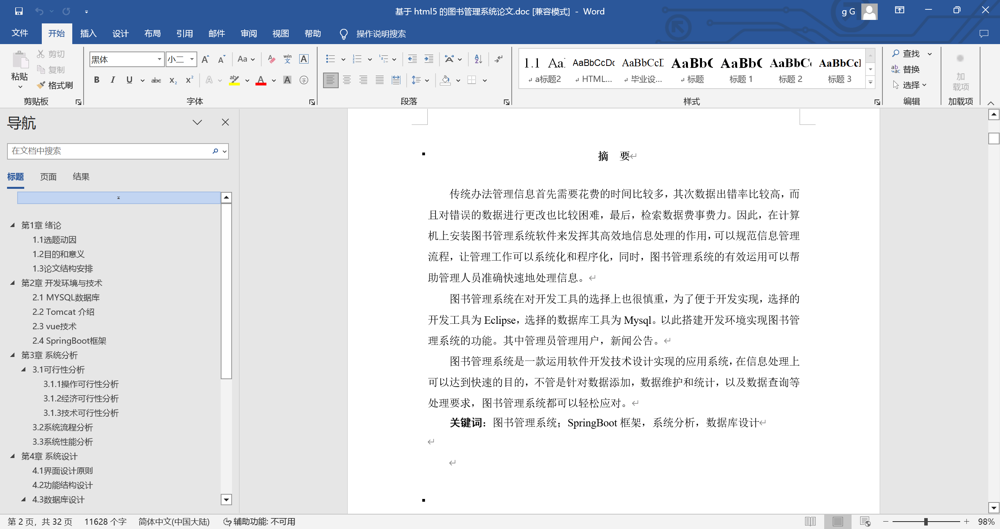
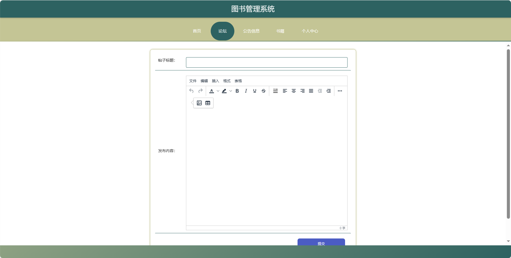
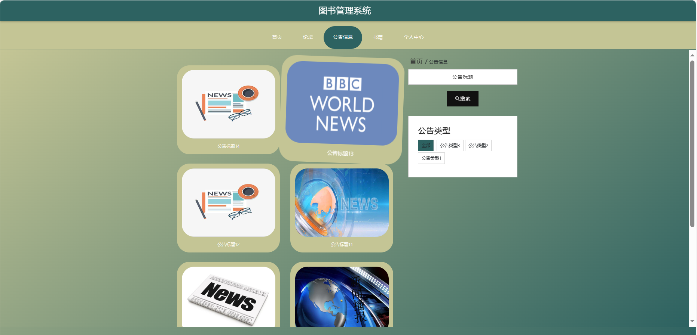
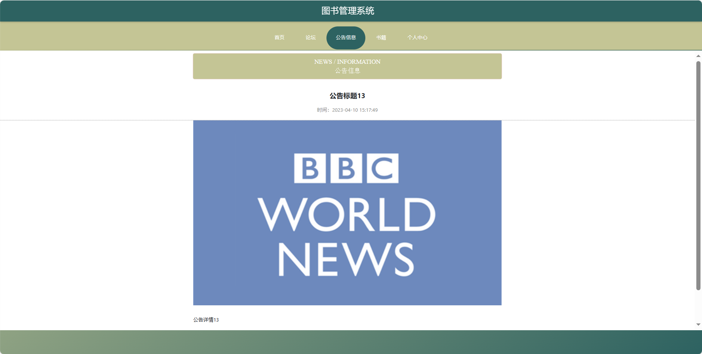
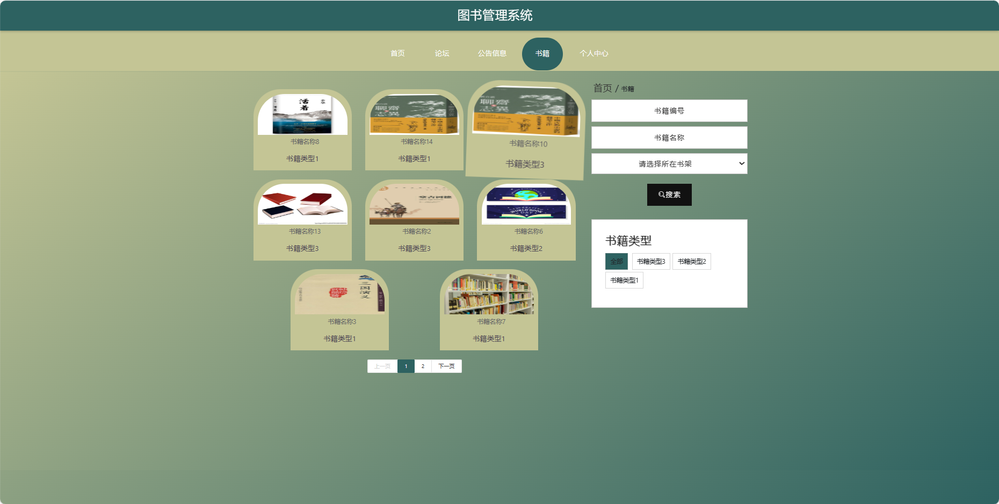
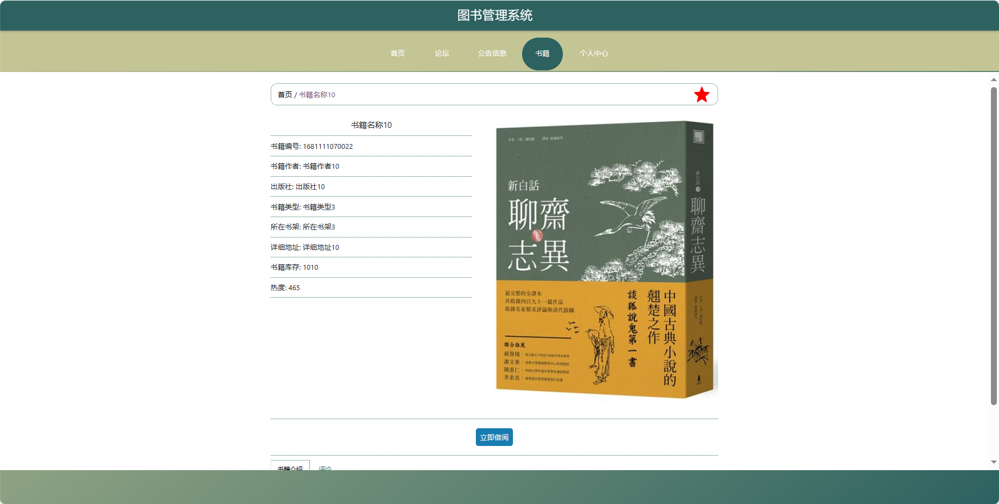
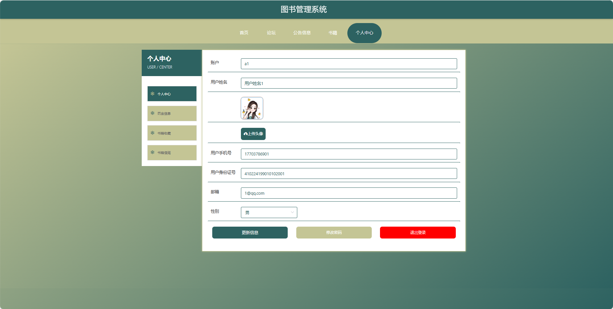
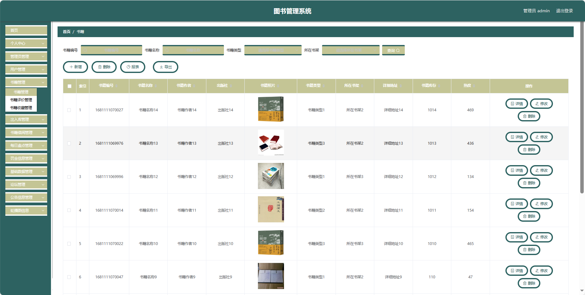

## 基于SpringBoot的图书管理系统(程序+报告)

###  获取sql数据库文件: 从戎源码网 (https://armycodes.com/) QQ: 386869957 QQ群: 377586148
###  所有系统地址: (https://github.com/YuLin-Coder/AllProjectCatalog) 
###  所有项目以及源代码本人均调试运行无问题 可支持远程安装部署调试、定制修改、代码讲解

## 项目介绍
基于SpringBoot的图书管理系统，系统包含两种角色：管理员、用户,系统分为前台和后台两大模块，主要功能如下。

### 【管理员】:
1. 首页：提供管理员进入后台管理的入口。
2. 个人中心：管理员可以管理个人信息。
3. 管理员管理：添加、编辑、删除系统管理员账号。
4. 用户管理：查看、编辑、冻结或删除用户账号。
5. 书籍管理：添加、编辑、删除图书信息。
6. 出入库管理：记录图书的出入库信息。
7. 书籍借阅管理：管理用户的借阅记录。
8. 每日盘点管理：对图书馆的图书进行每日盘点。
9. 罚金信息管理：记录用户逾期归还图书所产生的罚金信息。
10. 基础数据管理：管理系统的基础数据。
11. 论坛管理：管理论坛板块，包括发布、删除帖子。
12. 公告信息管理：发布、编辑、删除系统公告。
13. 轮播图信息：管理员可以设置首页轮播图。

### 【前台】:
1. 首页：提供用户进入系统的入口，展示热门书籍、公告等信息。
2. 论坛：用户可以在论坛上进行图书讨论。
3. 公告信息：用户可以查看系统发布的公告。
4. 书籍：用户可以浏览图书馆的书籍。
5. 个人中心：用户可以管理个人信息。

## 项目技术
- 编程语言：Java
- 数据库：MySQL
- 项目管理工具：Maven
- 前端技术：HTML、CSS、JavaScript、Jquery、Vue
- 后端技术：Spring、SpringMVC、MyBatis

## 运行环境
- JDK版本：JDK1.8及以上
- 开发工具：IDEA、Ecplise、Myecplise都可以
- 数据库: MySQL5.7及以上
- Maven：maven3.0及以上
- Node：14.14.0及以上

## 运行截图

